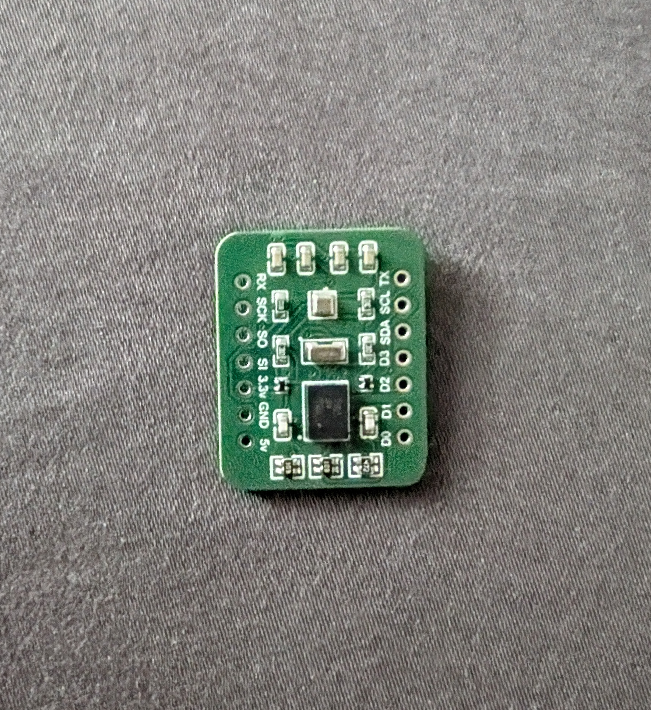
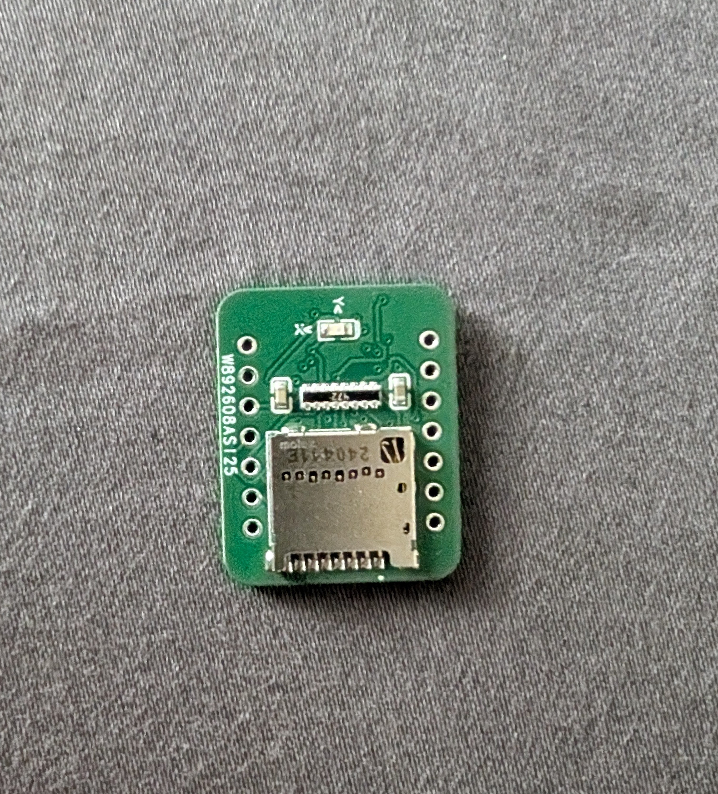

# 🧠📡 XIAO-ESP32S3-HAT-module
This project is a custom HAT designed for the **XIAO ESP32S3** that integrates a **BNO086 IMU**, a **BMP581 barometer**, and an **SD card slot**, all within the same compact footprint as the XIAO module itself. 

It was created to address a common challenge in embedded systems and robotics: combining multiple sensors and a data logging solution without adding bulk or complexity. Typically, developers rely on separate breakout boards for motion sensing, altitude measurement, and SD storage, which increases wiring, consumes more space, and can be fragile, especially in mobile or space-constrained applications.

By integrating all three components onto a single board, this HAT offers a clean, efficient, and compact alternative. The **BNO086** and **BMP581** sensors both communicate via the **I²C bus**, simplifying connections and saving pins. The **SD card slot** operates over **SPI** for fast and reliable data logging.

This design is ideal for projects that require real-time sensor fusion and high-speed data recording, such as robotics, drone flight logging, wearables, and other embedded systems. With this HAT, users can deploy complex sensor-based applications using a single, tightly integrated module that mounts directly onto the XIAO ESP32S3.

---

## 📁 File Structure
CODE

  - IMU_Test: Reads and logs accelerometer, gyro, and magnetometer data
  
  - Baro_Test: Reads and logs temperature, pressure, and altitude
  
Hardware

  - BOM.csv: Bill of Materials
  
  - Gerber.zip: Gerber files for fabrication
  
  - Pick_and_Place.csv: Pick & Place file for assembly
  
Schematic

  - XIAO_HAT_Schematic.pdf # Circuit schematic of the module

---

## 📚 Library References

To run the code, install the following Arduino libraries:

- **SparkFun BNO086 IMU Library:**  
  https://github.com/sparkfun/SparkFun_VR_IMU_Breakout_BNO086_QWIIC

- **SparkFun BMP581 Barometer Library:**  
  https://github.com/sparkfun/SparkFun_Qwiic_Pressure_Sensor_BMP581

For more info, search `"SparkFun BMP581"` and `"SparkFun BNO086"` on Google.

---

## 📷 Images

  
  
  
  

---

## 🛠️ PCB Fabrication & Assembly

To manufacture and assemble the board, you can place the order at: [**PCBWay**](https://www.pcbway.com/project/shareproject/ESP32_HAT_IMU_Baro_SD_card_module_d01a1b4e.html):

---

Happy building!
